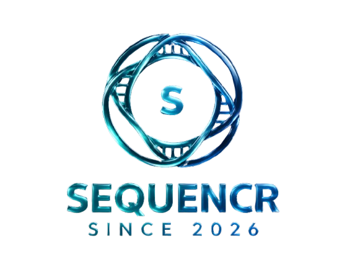

<p align="center">
  
</p>

<h1 align="center">Sequencr</h1>

<p align="center">
  A free, open-source, privacy-first video editor that runs entirely in your browser.
  <br />
  No watermarks. No subscriptions. No uploads. Your footage never leaves your device.
</p>

<p align="center">
  <a href="https://github.com/Hideyukiakaza/sequencr">GitHub</a> ·
  <a href="#quick-start">Quick Start</a> ·
  <a href="#features">Features</a> ·
  <a href="#keyboard-shortcuts">Keyboard Shortcuts</a> ·
  <a href="#contributing">Contributing</a>
</p>

---

## What is Sequencr?

Sequencr is a timeline-based video editor built for everyday users who want a simple, capable tool without giving up their privacy or paying a subscription. It is a free and open-source alternative to CapCut.

Everything runs locally. The app processes your video files directly in the browser using a bundled copy of FFmpeg — no server, no account, no internet connection required after the first load.

---

## Quick Start

### Prerequisites

You need **Node.js version 18 or higher** installed. Check yours with:

```bash
node --version
```

If you need to install or update Node.js, download it from https://nodejs.org (choose the LTS version).

### Installation

**Step 1 — Clone the repository**

```bash
git clone https://github.com/Hideyukiakaza/sequencr.git
cd sequencr
```

Or if you downloaded a zip file, unzip it and open a terminal inside the folder.

**Step 2 — Install dependencies**

```bash
npm install
```

This may take a minute on the first run.

**Step 3 — Start the app**

```bash
npm run dev
```

**Step 4 — Open in your browser**

Go to `http://localhost:5173`

> ⚠️ Do not open `index.html` directly in your browser. The app requires the development server to work. Always use the `http://localhost:...` URL printed in your terminal.

---

## Building for Production

To create an optimised build to self-host or share:

```bash
npm run build
npm run preview
```

The `dist/` folder contains the complete built app. You can deploy it to any static hosting service such as GitHub Pages, Netlify, or Vercel.

---

## Features

### Timeline Editor
- Multi-track timeline with 2 video tracks, 2 audio tracks, and 1 text track
- Drag clips from the asset library onto any track
- Drag clips along the timeline to reposition them
- Zoom in and out on the timeline using the zoom controls
- Playhead scrubbing for frame-accurate navigation

### Clip Editing
- **Trim** — drag the left or right edge of any clip to shorten it
- **Split** — select a clip and press `S` to cut it at the playhead position
- **Delete** — select a clip and press `Delete` or `Backspace` to remove it

### Visual Effects & Styles
- 8 one-click presets: Grayscale, Sepia, Invert, Vivid, Cinematic, Warm, Cool
- Manual sliders for Brightness, Contrast, Saturation, Hue, Blur, and Opacity
- All effects are previewed in real time in the preview window

### Transitions
- 8 transition types: Fade, Dissolve, Wipe Left, Wipe Right, Wipe Down, Slide Left, Slide Right, Zoom
- Adjustable transition duration (0.1s – 2.0s)
- Set via the Transition tab in the Properties panel when a clip is selected

### Audio Tools
- Per-clip volume control (0–200%)
- Fade In and Fade Out per clip (0–3 seconds each)
- Waveform visualisation on audio clips in the timeline
- Visual fade envelope display in the Properties panel

### Text & Titles
- Add text overlays on a dedicated text track
- Control font family (Sans, Serif, Mono, Display), size, colour, and background
- Set text position anywhere on the canvas using X/Y percentage sliders
- Entry animations: Fade In, Slide Up, Slide Down
- Live preview of text overlays in the preview window

### Export
- Exports to MP4 using the locally bundled FFmpeg engine
- All effects, transitions, audio settings, and text overlays are baked into the export
- No watermark is added at any point
- Export progress is shown in the header

---

## How to Use

### Importing media

Click the **+** button or drag video and audio files into the Asset Library panel on the left. Supported formats include MP4, MOV, WebM, MP3, WAV, and AAC.

### Building your timeline

Drag any asset from the library onto a track in the timeline. Video files go on video tracks, audio files go on audio tracks. Use the text track for titles and captions.

### Editing a clip

Click a clip to select it. The Properties panel on the right will show options for that clip:
- **Style tab** — adjust visual effects and presets
- **Transition tab** — set the transition into this clip
- **Audio tab** — set volume and fades
- **Text tab** — visible only for text track clips

### Previewing

Press the play button to preview your edit. The preview window shows your video with all effects and text overlays applied in real time.

### Exporting

Click the **Export** button in the top-right corner. The app will process your timeline using FFmpeg and download the finished MP4 to your Downloads folder. Keep the browser tab open during export.

---

## Keyboard Shortcuts

| Action | Shortcut |
|---|---|
| Split clip at playhead | `S` |
| Delete selected clip | `Delete` or `Backspace` |

---

## Project Structure

```
sequencr/
├── public/
│   └── ffmpeg/              # Bundled FFmpeg WASM binaries (offline processing)
├── src/
│   ├── components/
│   │   ├── assets/          # Asset library and file import
│   │   ├── effects/         # Properties panel (effects, transitions, audio, text)
│   │   ├── preview/         # Video preview window
│   │   └── timeline/        # Timeline, tracks, and clip rendering
│   ├── services/
│   │   └── videoService.ts  # FFmpeg integration and export logic
│   ├── store/
│   │   └── useStore.ts      # Zustand state management
│   └── types/
│       └── index.ts         # TypeScript interfaces
└── src-tauri/               # Future desktop app (macOS/Windows via Tauri)
```

---

## Tech Stack

| Layer | Technology |
|---|---|
| UI Framework | React 19 + TypeScript |
| Build Tool | Vite |
| Styling | Tailwind CSS v4 |
| State Management | Zustand |
| Video Processing | FFmpeg.wasm (locally bundled) |
| Icons | Lucide React |
| Desktop (future) | Tauri |

---

## Known Limitations

- Export of very long timelines may be slow due to browser memory constraints
- Custom fonts are not supported in export (preview uses system fonts; export uses Arial/Times New Roman/Courier New/Impact)
- Wipe and Slide transitions work best when clips are adjacent with no gap between them
- The Tauri desktop build is scaffolded but not yet functional — the browser is the supported platform for now

---

## Contributing

Contributions are welcome. To get started:

```bash
git clone https://github.com/Hideyukiakaza/sequencr.git
cd sequencr
npm install
npm run dev
```

Please open an issue before submitting large changes so we can discuss the approach first.

---

## License

MIT — free to use, modify, and distribute.
